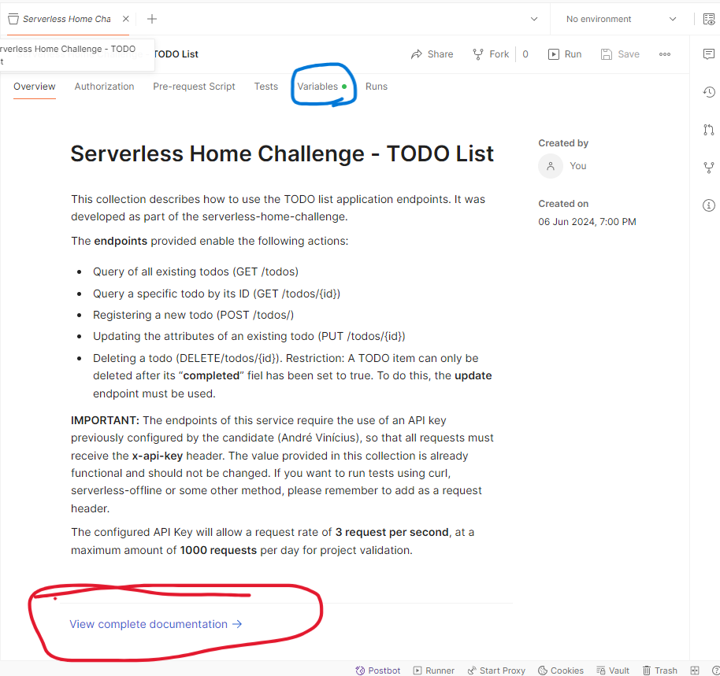

# Serverless Home Challenge
### Project Overview

Esse documento descreve o passo a passo para configuração e teste das APIs desenvolvidas para o projeto TODO list. O projeto fornece endpoints para manipulação de itens de uma lista de tarefas. Os requisitos referentes ao desenvolvimento deste projeto estão descritos: [neste documento](./serverless-home-challenge.pdf).

Diagrama de visão geral da aplicação: 

Todos os endpoints configurados para esse projeto, instruções de uso e configurações necessárias estão descritos nessa [postman collection](./serverless-home-challenge.pdf). **Por favor faça o download** antes de seguir.

**Importante:** Para validação deste projeto poderão ser utilizados os seguintes caminhos:

**1-** Utilizando os endpoints que já estão hospedados em ambiente AWS na conta do desenvolvedor do projeto (André Vinícius). Para seguir com este caminho, nenhum setup adicional é necessário, dado que a API (API Gateway), funções Lambda e banco de dados DynamoDB já estão hospedados e prontos para uso. Essa API somente receberá requisições contendo uma API-key válida, que já está configurada como uma variável de collection do Postman fornecida na sessão "anexos" e é necessária em todos os endpoints. 

**2-** Fazendo deploy do projeto em qualquer conta AWS. A configuração de todos os recursos foi feita via Serverless Framework. O projeto está pronto para ser implantado de forma automatizada e as instruções estão fornecidas na sessão "setup". 

**3-** Testes locais: Neste projeto utilizou-se o plugin serverless-offline, que permite um ciclo de desenvolvimento e testes mais rápidos por meio de endpoints rodando em ambiente local, sem necessidade de publicação em ambiente AWS a todo momento.

**Importante:** Independemente de qual caminho de validação será utilizado, ressalta-se que o projeto também conta um conjunto de testes unitários a fim de validar o comportamento das funções Lambda envolvidas. Para isso utilizou-se a biblioteca "pytest" juntamente com a biblioteca "moto" para simulação do comportamento de serviços AWS. 

> Note: Recomendo fortemente o uso do Software Postman para validação dos endpoints utilizando as collections fornecidas, que já estão configuradas para uso.

### Setup Guide
##### Testes utilizando a API já hospedada
Como mencionado anteriormente, para seguir este caminho de validação basta fazer o download da collection do Postman disponível na sessão "anexo". **Importante:** O caminho raíz da collection (Serverless Home Challenge - TODO List) contém uma descrição geral do serviço e contém um link de conteúdo **"View complete documentation"**, cujo conteúdo descreve detalhadamente cada um dos endpoints disponíveis, campos e formatos exigidos e exemplos de payloads válidos e inválidos:

##### Fazer deploy automatizado em ambiente AWS
Para seguir com a configuração do projeto na sua própria conta AWS, siga o passo-a-passo abaixo:
###### Pré requisitos (por favor não avance para a etapa de setup antes de validar os seguintes itens): 
Conta AWS criada; 
Node JS instalado (necessário para execução dos comandos do Serverless Framework);
Python a partir da versão 3.10 (necessário caso queira rodar os endpoints de API localmente por meio do serverless-offline plugin);
Usuário IAM da AWS configurado para acesso programático via Access Keys. **Caso ainda não tenha esse usuário AWS com acesso programático configurado**, execute os seguintes passos:
 - Dentro de sua conta AWS, acesse o console do serviço IAM
 - Em "users", clique em "create user", forneça um nome de sua preferência e avance
 - Na tela seguinte, selecione "Attach policies directly" e inclua a policy "AdministratorAccess". Essa policy deverá ser utilizada apenar em ambientes de testes para simplificar o processo de validação dos endpoints. Por razões de segurança ela não deverá ser utilizada em ambiente de produção e deverá ser substituida por uma que tenha apenas os acessos necessários. 
 - Avance para a tela de revisão e conclua a criação do usuário.
 - De volta à tela de listagem de usuários, selecione o usuário que você acabou de criar, acesse a aba "Security Credentials" e clique no botão "Create Access Key". Em "use case", Selecione a opção "Command Line Interface (CLI)" e marque a caixa de confirmação. Após confirmar o procedimento, você receberá os valores de "Access Key" e "Secret access key". Eles serão necessários para a configuração do Serverless Framework, permitindo que o mesmo faça deploy de recursos em sua conta AWS. 
    
###### Setup do ambiente: 
 - Realize o download deste projeto utilizando o meio de sua preferência (Git Clone ou download .zip file)
 - Utilizando um terminal, execute o comando `npm i serverless -g`. Isso instalará o serverless framework em sua máquina e o tornará acessível a partir de qualquer diretório.
 - Crie um usuário na AWS e habilite as Access Keys.
 - Acesse o diretório raiz do projeto baixado e execute o comando `serverless config`. 
 - Ainda no diretório raiz do projeto, faça a instalação dos plugins necessários, através dos comandos `npm install serverless-offline --save-dev` e `npm install serverless-python-requirements` 
 - Para seguir com o deploy, execute o comando `serverless deploy` 

###### Ajustes finais: 
Neste ponto sua aplicação já deve estar hospedada em sua conta AWS e pronta para uso. Para consultar seu endpoint de requisições, acesse sua conta AWS e, no serviço Amazon API Gateway, selecione a API que acabou de ser criada (serverless-challenge). No menu lateral, acesse "stages". Nesse tela, copie o valor de "Invoke URL". Essa será a URL de base para todas as chamadas em sua API. 

A partir daqui, basta abrir a Postman collection fornecida e atualizar o valor da variável "serverless_api_challenge_url". Para isso, na raiz da collection, basta acessar a aba "variables" e substituir os campos "initial value" e "current value" com a sua URL de invocação, conforme mostrado abaixo:

> Note: Utilizando o método de deploy em sua própria conta, não será necessário o uso de API keys nas requisições, pois essa configuração não faz parte do template fornecido no projeto e foi configurada separadamente.

##### Testes locais
1) Testes unitários - setup:
 - Dentro do diretório "serverless-home-challenge", executar os comandos `pip install -r requirements.txt`. Isso irá configurar as bibliotecas pytest, moto e boto3.
 - Após a instalação das bibliotecas, basta executar o comando `pytest`, que identificará automaticamente todos os arquivos de teste (localizados no diretório "tests" e executará todos os casos descritos). Em cada um dos casos, há uma descrição da funcionalidade a ser testada.

2) Além dos testes unitários, pode-se usar o serverless-offline para testar suas APIs localmente. Para isso, basta acessar o diretório serverless-home-challenge e executar o comando `serverless offline`. Isso viabilizará testes locais utilizando por padrão o endereço localhost:3000 como url base de suas APIs. Após essa configuração, você poderá utilizar o postman ou uma janela de terminal para executar requisições como `curl http://localhost:3000/dev/todos`

### Architecture discussion
As configurações dos componentes de arquitetura deste projeto **não** foram pensadas para um cenário real pronto para produção. Isso significa que foram mantidas as configurações padrão, sem maiores preocupações quanto a detalhes de configuração. Alguns desses detalhes incluem.
 - **Funções Lambda**: A AWS permite fazer um ajuste fino da capacidade de CPU e memória a ser alocada nas funções, bem como configurações de conectividade (endpoint público) e pré-aquecimento de ambiente de execução a fim de evitar cold-starts. 
- **Integração entre API Gateway, Lambda e DynamoDB**: a fim de seguir apropriadamente as especificações do documento de requisitos, foram utilizadas funções Lambda para representar o comportamento de cada endpoint. Apesar disso, é importante mencionar que o serviço Amazon API Gateway conta com integração nativa com o DynamoDB, permitindo realizar operações de CRUD sem a necessidade de uma função Lambda intermediando. Isso pode ser benéfico para diminuir a latência das requisições e o custo do projeto, eliminando um componente de arquitetura.
- **Tipo de endpoint do API Gateway**: O API Gateway permite a configuração de diferentes de tipos de deployment de endpoints. Esse projeto faz uso de uma API do tipo REST hospedada em configuração EDGE-optimized, que faz uso das CDNs da AWS para distribuição dos pontos de presença. Outras configurações estão disponíveis, como as APIs regionais e privadas. Além disso existe a possibilidade de configurar o modelo da API para o tipo HTTP, que apresenta menor custo em troca de oferecer um conjunto reduzido de funcionalidades para os endpoints.
- **Configuração de CORS do API Gateway**: Para simplificação, todos os endpoints deste projeto estão configurados para permitir requisições de origens diferentes do host (CORS), o que facilita a integração com aplicações de front-end em ambiente de testes. Para ambientes de produção é necessário ajuste fino nessa configuração.
- **Tabela do DynamoDB**: As tabelas do DynamoDB podem ser configuradas para suportar diferentes formas de capacidade de provisionamento de leitura e escrita, o que não foi levado em consideração no escopo de entrega deste projeto. Além disso, para projetos de maior porte é possível trabalhar com índices para otimização de desempenho em consultas, por meio de Global Secondary Indexes ou Local Secondary Indexes.

### Outros pontos técnicos para discussão
- **Consultas no DynamoDB**: O código utilizado neste projeto faz uso das API de scan() do dynamodb. Por se tratar de um ambiente de demonstração e validação, isso não afeta a aplicação de modo geral, porém em grandes bases de dados recomenda-se utilizar as APIs de query(), que são menos custosas em termos de performance, pois consomem menos capacidade de leitura por ser restritas a partições específicas que se queira consultar.
- **Validações a nível de API Gateway**: Todos os endpoints que requerem o fornecimento de um body estão sendo validados a nível do API Gateway. Isso impede que payloads com corpos inválidos cheguem às funções Lambda, evitando desperdício de capacidade de processamento e custos desnecessários.
- **Testes unitários**: Os testes desenvolvidos estão restritos a validação de comportamento das funções Lambda, sem maiores preocupações quanto à sua integração com o Amazon API Gateway. Isso porque as validações de payload estão sendo realizadas a nível de API Gateway, que serão o único caminho de acesso às funcionalidades dessas funções.

