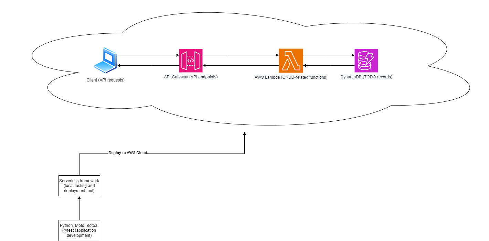
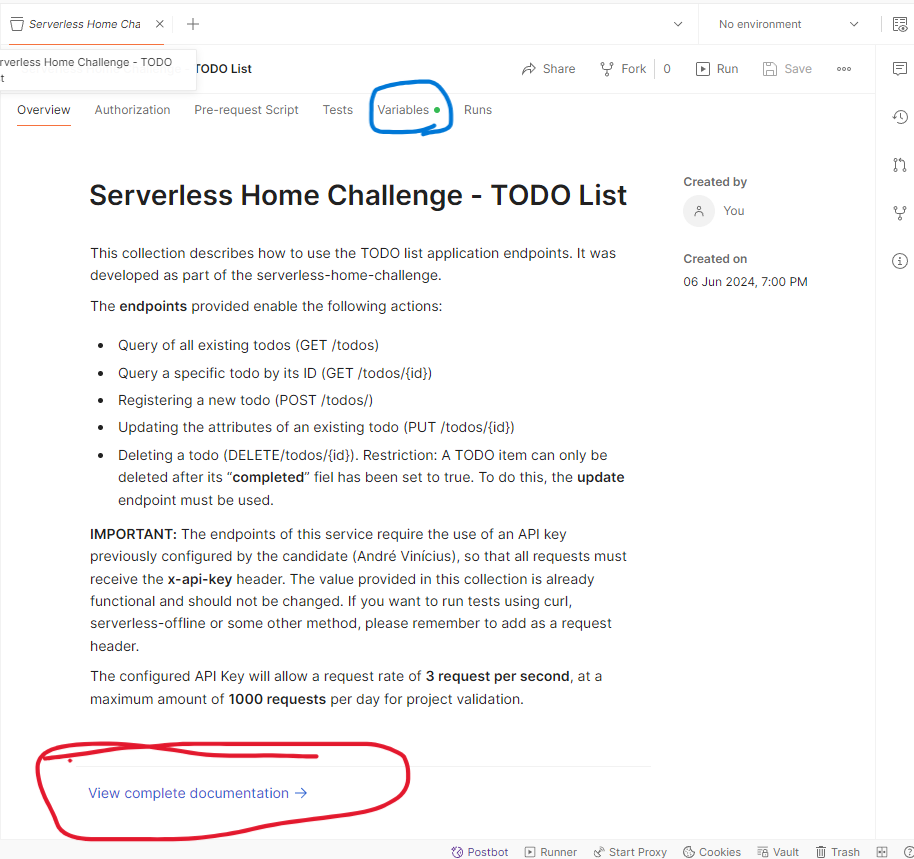

# Serverless Home Challenge
### Project Overview

This document describes the step-by-step process for configuring and testing the APIs developed for the TODO list project. The project provides endpoints for manipulating items in a task list. The requirements relating to the evaluation of this project are described: [in this document](./media/serverless-home-challenge.pdf).

Application overview diagram:

All endpoints configured for this project, usage instructions and necessary configurations are described in this [postman collection](./media/serverless-home-challenge.json). **Please download it** before proceeding.
To use this collection, you just need to open Postman on your computer, go to "collections", click the "import" button and select the json file

**Important:** There are many available methods to validate this project. The items below gives an overview of each method.

**1-** Using the endpoints that are already hosted on the developer's (André Vinícius) AWS account. To follow this path, no additional setup is necessary, as the API (API Gateway), Lambda functions and DynamoDB database are already hosted and ready to use. This API will only accept requests containing a valid API-key, which is already configured as a Postman collection variable. Its utilization is required in all endpoints.

**2-** Deploying the project to any AWS account. Configuration of all resources was done via Serverless Framework. The project is ready to be deployed in an automated way and instructions are provided in the "setup" session.

**3-** Local testing: In this project, the serverless-offline plugin was used, which allows a faster development and testing cycle through endpoints running in a local environment, without the need to publish in an AWS environment at all times.

**Important:** Regardless of which validation method will be used, it should be noted that the project also has a set of unit tests in order to validate the behavior of the Lambda functions involved. Instructions on how to proceed with this tests are also provided below in this document.

> Note: I strongly recommend using the software Postman to validate the endpoints. It is also recommended to use [this postman collection](./media/serverless-home-challenge.pdf), which is already configured for use.

### Setup Guide
##### Tests using the already hosted API
As mentioned previously, to follow this validation method simply download the Postman collection and open it using Postman.
**Important:** The root path of the collection (Serverless Home Challenge - TODO List) contains a general description of the service and contains a link to **"View complete documentation"**, whose content describes in detail each of the available endpoints, required fields and formats, and examples of valid and invalid payloads:

##### Automated deployment in a separate AWS environment
To continue setting up the project in your own AWS account, follow the step-by-step instructions below:

###### Prerequisites (please do not proceed to the setup stage before validating the following items):
AWS account created;  
Node JS installed (necessary to execute Serverless Framework commands);  
Python - at least version 3.10 - (required if you want to run the API endpoints locally through the serverless-offline plugin);  
(optional but recommended): [Postman](https://www.postman.com/downloads/)
AWS IAM user configured for programmatic access via Access Keys. **If you do not already have this AWS user with programmatic access configured**, perform the following steps:  
 - Within your AWS account, access the IAM console;
 - Under "users", click "create user", provide a name of your choice and proceed;
 - On the next screen, select "Attach policies directly" and include the "AdministratorAccess" policy. This policy should only be used in test environment to simplify the endpoint validation process. For security reasons it should not be used in a production environment and should be updated with more restrictive permissions.
 - Proceed to the review screen and complete user creation.
 - Back on the user list screen, select the user you just created, access the "Security Credentials" tab and click the "Create Access Key" button. In "use case", select the "Command Line Interface (CLI)" option and check the confirmation box. After confirming the procedure, you will receive the values ​​for "Access Key" and "Secret access key". They will be necessary for configuring the Serverless Framework, allowing it to deploy resources to your AWS account.

###### Project folder structure:

###### Environment setup:
 - Download this project using your preferred method (Git Clone or download .zip file)
 - Open the project folder using the code editor of your preference. I recommend using VS Code  
 - With the project folder open, navigate to the serverless-home-challenge project subfolder by running `cd serverless-home-challenge`.
 - Using a terminal, run the command `npm i serverless -g`. This will install the serverless framework on your machine and make it accessible from any directory.
 - You will also need to install some additional npm packages for local testing. To do this, run `npm install serverless-offline --force`, followed by `npm install serverless-python-requirements --force` 
 - After this package installation steps, run `serverless config`  
 - At this point you may be requested to Login/Register to the Serverless Framework service. Please proceed with the authentication or registration process following the guidelines provided on the screen.
 - When prompted about "Create Or Select An Existing App", just select the option "Skip Adding An App"
 - You will also may be asked to configure AWS credentials. If it is the case, you will receive a warning similar to "AWS credentials missing or invalid. Run 'serverless' to set up AWS credentials. If it happens, please proceed with this configuration. When prompted about AWS credentials, select the option "Save AWS Credentials in a Local Profile". Then, enter the AWS Access Key Id and Secret Access Key that you created using AWS IAM.
 - Still in the project root directory, install the necessary plugins, using the commands `npm install serverless-offline --save-dev` and `npm install serverless-python-requirements`
 - To continue with the deployment, run the `serverless deploy` command

###### Final adjustments:
At this point, your application should already be hosted in your AWS account and ready to use. To get your invocation endpoint URL, access your AWS account and, in the Amazon API Gateway service, select the API that was just created. In the side menu, access "stages". On this screen, copy the value of "Invoke URL". This will be the base URL for all calls to your API.

From here, simply open the provided Postman collection and update the value of the "serverless_api_challenge_url" variable. To do this, in the root of the collection, simply access the "variables" tab and replace the "initial value" and "current value" fields with your invocation URL, as shown below:

> Note: Using the deployment method in your own account, it will not be necessary to use API keys, as this configuration is not part of the project template and it was configured separately.

##### Local tests
1) Unit tests - setup:
 - Under the "serverless-home-challenge" directory, run the commands `pip install -r requirements.txt`. This will configure the pytest, moto and boto3 libraries.
 - After installing the libraries, simply run the `pytest` command, which will automatically identify all test files (located in the "tests" directory and execute all cases described). In each case, there is a description of the functionality to be tested.

2) In addition to unit testing, you can use serverless-offline to test your APIs locally. To do this, simply access the serverless-home-challenge directory and run the `serverless offline` command. This will enable local tests using localhost as your API address. After this configuration, you can use postman or a terminal window to execute requests such as `curl http://localhost:3000/dev/todos`

### Architecture discussion
The configuration of the architectural components of this project were **not** designed for a real production-ready scenario. This means that I kept the default settings, without any major concerns regarding configuration details. Some of these details include:

 - **Lambda functions**: AWS allows you to fine-tune the CPU and memory capacity to be allocated to the functions, as well as connectivity settings (public endpoint) and pre-warming of the execution environment in order to avoid cold-starts.
- **Integration between API Gateway, Lambda and DynamoDB**: in order to properly follow the specifications of the requirements document, Lambda functions were used to represent the behavior of each endpoint. It is important to mention that the Amazon API Gateway service has native integration with DynamoDB, allowing you to perform CRUD operations without the need for an intermediary Lambda function. This can be beneficial to reduce request latency and project cost by eliminating an architectural component.
- **API Gateway endpoint type**: API Gateway allows you to configure different types of endpoint deployments. This project makes use of a "REST" API hosted in an EDGE-optimized configuration, which makes use of AWS CDN to distribute the API at many points of presence. Other settings are available, such as regional and private APIs. Furthermore, there is the possibility of configuring the API model as "HTTP" type, which presents a lower cost in exchange for offering a reduced set of functionalities for the endpoints. More details provided [here](https://docs.aws.amazon.com/apigateway/latest/developerguide/http-api-vs-rest.html)
- **API Gateway CORS Configuration**: For simplicity, all endpoints in this project are configured to allow requests from origins other than the host (CORS feature enabled), which facilitates integration with front-end applications in a testing environment. For production environments, fine-tuning this configuration is necessary.
- **DynamoDB Table**: DynamoDB tables can be configured to support different forms of read and write provisioning capacity, which was not taken into account in the delivery scope of this project. Furthermore, for larger projects it is possible to work with indexes to optimize performance in queries, through Global Secondary Indexes or Local Secondary Indexes.

### Other technical points for discussion
- **Queries in DynamoDB**: The code used in this project makes use of the dynamodb scan() API. As it is a demonstration and validation environment, this does not affect the application in general, however in large databases it is recommended to use the query() APIs, which are less costly in terms of performance, as they consume less capacity during read operations because they are restricted to specific partitions that you want to query.
- **Validations at the API Gateway level**: All endpoints that require a payload body are being validated at the API Gateway level using JSON schemas. This prevents payloads with invalid bodies from reaching Lambda functions, avoiding wasted processing capacity and unnecessary costs.
- **Unit tests**: The tests developed are restricted to validating the behavior of Lambda functions, without major concerns regarding their integration with Amazon API Gateway. This is because payload validations are being carried out at the API Gateway level, which will be the only access path to the functionalities of these functions.

